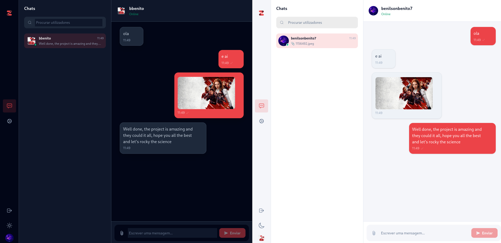
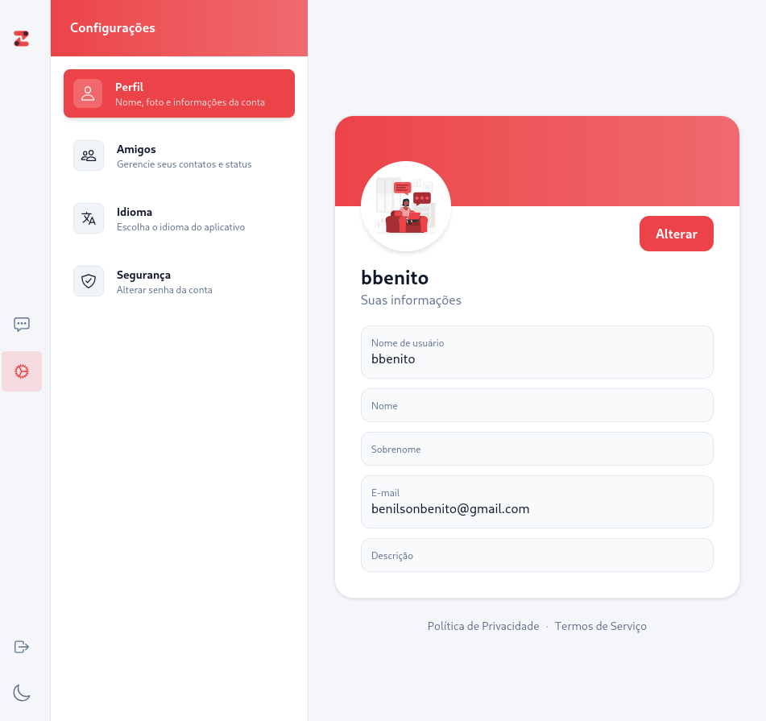

<div align="center">

# 💬 Rede — Real-time Chat App

**Uma aplicação de chat moderna, rápida e elegante.**  
Construída para conectar pessoas em tempo real, com suporte a mensagens, imagens e muito mais.

[](LICENSE)
[]()
[]()

</div>

---

## 🖼️ Screenshots

<div align="center">

### Modo Escuro


### Modo Claro


</div>

---

## ✨ Funcionalidades

- 💬 **Mensagens em tempo real** — troca de mensagens instantânea entre utilizadores
- 🖼️ **Envio de imagens** — partilha de ficheiros e imagens diretamente no chat
- 🌙 **Modo escuro / claro** — interface adaptável às preferências do utilizador
- 👤 **Perfil personalizável** — nome, foto, descrição e e-mail editáveis
- 🔍 **Pesquisa de utilizadores** — encontra contactos facilmente
- 🔒 **Segurança** — autenticação e gestão de senha da conta
- 🌍 **Suporte a idiomas** — configuração de idioma da aplicação
- ✅ **Confirmação de leitura** — indicadores de mensagem entregue

---

## 🛠️ Tecnologias Utilizadas

> _(Atualiza esta secção com as tecnologias reais do teu projeto)_

| Camada | Tecnologia |
|--------|------------|
| Frontend | React / Vue / HTML+CSS |
| Backend | Node.js / Python / etc. |
| Base de dados | MongoDB / PostgreSQL / etc. |
| Tempo real | Socket.io / WebSockets |
| Autenticação | JWT / Firebase Auth |

---

## 🚀 Como Executar Localmente

### Pré-requisitos

- Node.js instalado
- Git instalado

### Passos

```bash
# 1. Clona o repositório
git clone https://github.com/teu-usuario/rede.git

# 2. Entra na pasta do projeto
cd rede

# 3. Instala as dependências
npm install

# 4. Configura as variáveis de ambiente
cp .env.example .env
# Edita o ficheiro .env com as tuas configurações

# 5. Inicia o servidor de desenvolvimento
npm run dev
```

A aplicação estará disponível em `http://localhost:3000`

---

## 📁 Estrutura do Projeto

```
rede/
├── src/
│   ├── components/     # Componentes reutilizáveis
│   ├── pages/          # Páginas da aplicação
│   ├── services/       # Lógica de negócio e API
│   └── styles/         # Estilos globais
├── public/             # Ficheiros estáticos
├── .env.example        # Exemplo de variáveis de ambiente
└── README.md
```

---

## 🤝 Contribuições

Contribuições são bem-vindas! Segue estes passos:

1. Faz um **fork** do projeto
2. Cria uma branch: `git checkout -b minha-feature`
3. Faz commit: `git commit -m 'feat: adiciona nova funcionalidade'`
4. Faz push: `git push origin minha-feature`
5. Abre um **Pull Request**

---

## 👨‍💻 Autor

**bbenito** · [ibraimaugusto60@gmail.com](mailto:benilsonbenito@gmail.com)

---

<div align="center">
  Feito com ❤️ — projeto open source
</div>
